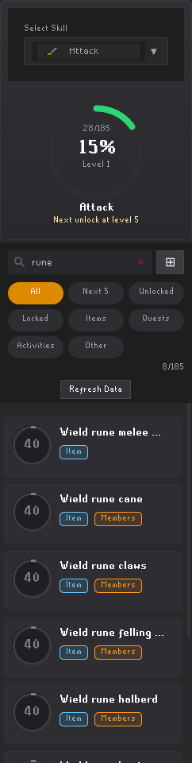

# Skill Unlocks for RuneLite

A RuneLite sidebar plugin for browsing OSRS skill unlocks by level. It reads level-up tables from the OSRS Wiki, with search, filters, and progress based on your in-game stats.

## Build from source

Install Git and a JDK (Java 11 or 17), and check `java -version`. The Gradle wrapper is included, so a separate Gradle installation is not needed. The first build downloads Gradle and dependencies from Maven Central and the RuneLite repository.

```bash
git clone https://github.com/EKarpinsky/runelite-level-up-table.git
cd runelite-level-up-table
./gradlew build --no-daemon
```

This compiles the plugin, runs the tests, and writes `build/libs/runelite-skill-unlocks-1.0-SNAPSHOT.jar`. On Windows, use `gradlew.bat` in place of `./gradlew`.

## Run locally

Build the development client JAR and launch it:

```bash
./gradlew shadowJar --no-daemon
java -ea -jar build/libs/runelite-skill-unlocks-1.0-SNAPSHOT-all.jar
```

On macOS, use the included `./run.sh` wrapper instead. It builds the same JAR and launches it with the macOS compatibility flags.

The JAR starts RuneLite with Skill Unlocks loaded through `SkillUnlocksPluginRunner`. A desktop display and network access are required. Log in to OSRS to see progress based on your character's levels; no game account is needed to build or run the tests.

1. Open **Skill Unlocks** in RuneLite's sidebar. Enable it in the plugin settings if needed.
2. Select a skill, then browse or search its unlocks.
3. Use the filters to narrow the list and the wiki buttons to read more.

## How it works

- [`WikiTextParser`](src/main/java/com/runelite/skillunlocks/service/parser/WikiTextParser.java) extracts unlocks, levels, and requirements from the wiki's `Level up table` markup, including `plink` and `SCP` templates.
- [`WikiHttpClient`](src/main/java/com/runelite/skillunlocks/api/WikiHttpClient.java) fetches OSRS Wiki pages with a 1 request/second rate limit.
- [`CacheManager`](src/main/java/com/runelite/skillunlocks/cache/CacheManager.java) stores JSON in `~/.runelite/level-up-table/`. It debounces saves and uses file locks; `UnlockRepository` coordinates the cache and wiki data.

## Tests and CI

```bash
./gradlew test --no-daemon
```

Parser tests live in `src/test/java/com/runelite/skillunlocks/service/parser/`. The HTML report is written to `build/reports/tests/test/index.html`.

GitHub Actions runs `./gradlew build --no-daemon` on pushes and pull requests with JDK 11, matching the Java release target in `build.gradle`. RuneLite dependencies use `latest.release`, so builds require network access and can be affected by upstream releases.

## Screenshot



The actual Skill Unlocks panel inside RuneLite, captured while logged out, using
live OSRS Wiki data and the search term `rune`. Level 1 is the panel's
logged-out default, not a player's stats. [Full client screenshot](docs/client.png).

Regenerate both screenshots on Linux with a JDK 11 or 17, its desktop JRE, Xvfb,
and `xauth` installed:

```bash
scripts/capture/panel.sh
```

The script builds the development client, starts it under Xvfb with an isolated
temporary home, opens Skill Unlocks, and applies the search. It checks that the
search returns matching unlocks and that both PNGs stay under 1 MB. No account,
login, or fixture data is used. It leaves the game's terms dialog untouched.
Network access is required; wiki content and RuneLite's `latest.release` may
change the results. The sidebar is captured at its native desktop width, with
a 1440px full-client image for context.

The temporary home is deleted automatically. After checking the images, remove
local build output with `rm -rf build .gradle`.

## License and credits

[BSD 2-Clause](LICENSE). Built on the [RuneLite](https://runelite.net) plugin framework with data from the [OSRS Wiki](https://oldschool.runescape.wiki).
